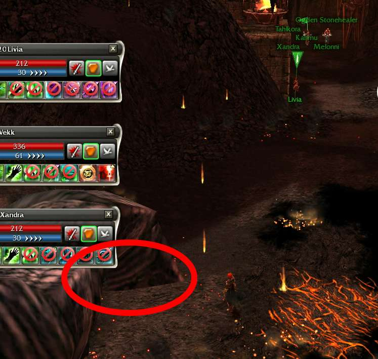
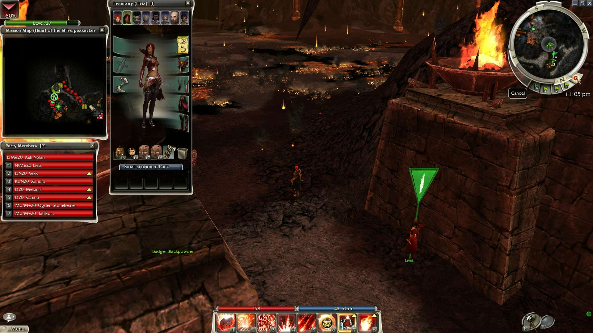
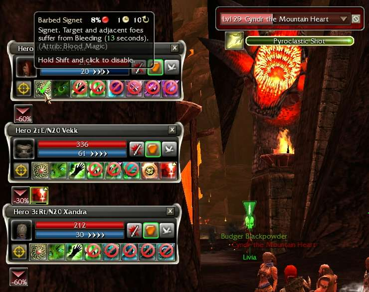

How to Defeat Cyndr the Mountain Heart (Guild Wars 1)
=====================================================

[Cyndr the Mountain Heart](https://wiki.guildwars.com/wiki/Cyndr_the_Mountain_Heart)
is the pseudo-boss encountered on level 3 of the
[Heart of the Shiverpeaks](https://wiki.guildwars.com/wiki/Heart_of_the_Shiverpeaks)
dungeon during the
[quest](https://wiki.guildwars.com/wiki/Heart_of_the_Shiverpeaks_(quest))
of the same name.
Cyndr is immune to damage while protected by its thick carapace, a defense that
can only be (briefly) taken down with three blasts from
[Dwarven Powder Kegs](https://wiki.guildwars.com/wiki/Dwarven_Powder_Keg)
provided by the NPC Budger Blackpowder.
The Dwarven Powder Keg mechanic in combination with Cyndr's hard-hitting area of
effect skills make this fight especially difficult for a 7-hero team.

This guide presents a simple strategy for cheesing Cyndr by using conditions and
life steal to bypass its carapace.
The strategy requires resources that should be available by the time you accept
the Heart of the Shiverpeaks quest.
For reference I beat Cyndr using a Prophecies character that had yet to complete
the Report to the White Mantle quest, and had done the minimum number of quests
required to travel from Lion's Arch to Kaineng City and Kamadan, Jewel of Istan.

## Setup
Add a necromancer hero to your party and equip them with the skills
[Barbed Signet](https://wiki.guildwars.com/wiki/Barbed_Signet) and
[Vampric Gaze](https://wiki.guildwars.com/wiki/Vampiric_Gaze).
At this point in the Eye of the North questline you have access to Livia, a hero
who specializes in blood magic by default.
Vampric Gaze is unlocked when Livia joins your party, and Barbed Signet can be
unlocked from the hero skill trainer in Kamadan, Jewel of Istan.
Make sure that your necromancer hero has plenty of points in their blood magic
attribute.
For reference I used Livia with a blood magic attribute of 12.

Compose the rest of your party as if you were performing a generic dungeon run.
I was using three heroes specializing in blood magic during the attempt in which
I defeated Cyndr, but as it turns out one hero specializing in blood magic is
more than sufficient, and the rest of your party composition is more or less
irrelevant.

## Execution
Enter the Heart of the Shiverpeaks dungeon and make your way down to level 3
where Cyndr resides.
This strategy will work with all party members at -60% death penalty, so it is
okay if one or more party members die along the way.

There are two large stone structures at the entrance to the final chamber.
Your goal is to get Cyndr and your necromancer hero into a sweet spot where
your hero can use Barbed Signet and Vampric Gaze from behind the cover while
Cyndr continuously tries (and fails) to hit your hero with Pyroclastic Shot.
Although the exact positions of Cyndr and your necromancer hero will vary from
attempt to attempt, the two images below provide a rough idea of where the two
need to be in order for this strategy to work.

It is unlikely that Cyndr will have an optimal spawn, so the first
portion of the fight will likely involve exploding Dwarven Powder Kegs near
Cyndr until it moves to a suitable position.

Once Cyndr and your necromancer hero are in position, remove the primary weapon
from your hero and disable all their skills except Barbed Signet and Vampric
Gaze.
This will prevent them from accidentally moving away from their flagged location
and/or wasting energy.
If you command your necromancer hero to use Barbed Signet then they will
automatically use Vampric Gaze immediately after.
The next five to six minutes of the fight will consist of ordering your hero to
use Barbed Signet, watching them use Barbed Signet and Vampric Gaze, rinse and
repeat.
The -3 Health degeneration from Barbed Signet mostly cancels out Cyndr's health
regeneration, and the life steal from Vampric Gaze will slowly whittle down
Cyndr's health until it dies.

In some cases your hero will appear to be in the correct position, but Cyndr
will be able to hit them with
[Bed of Coals](https://wiki.guildwars.com/wiki/Bed_of_Coals).
If this happens, move the player character far away from the action and try
adjusting the necromancer hero's flag location until they find the sweet spot.

Good luck and have fun!

## Thanks

The idea for this strategy was based on discussion from the
[Guild Wars Wiki](https://wiki.guildwars.com/wiki/Talk:Cyndr_the_Mountain_Heart)
as well as a 2009
[blog post](https://kp99.wordpress.com/2009/03/10/how-to-kill-cyndr-the-mountain-heart/)
from kidpurple.
Special thanks to everyone for their work in developing the idea to use
conditions and life steal to drain Cyndr's health as well as the
descriptions of how to position your hero to avoid taking damage.
