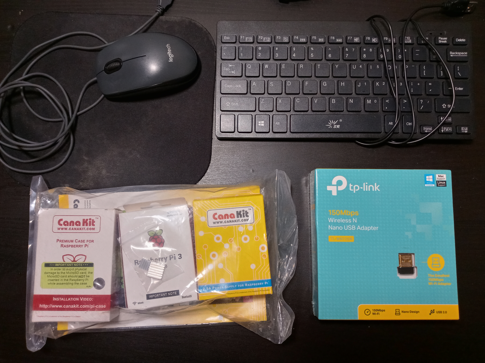
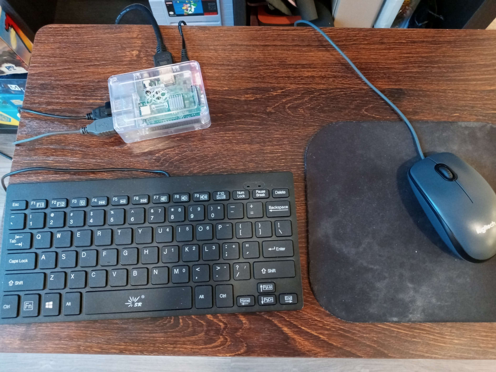
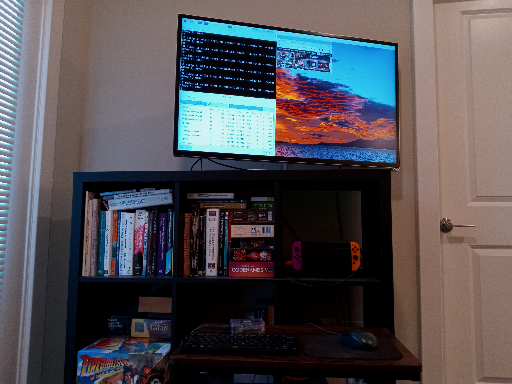
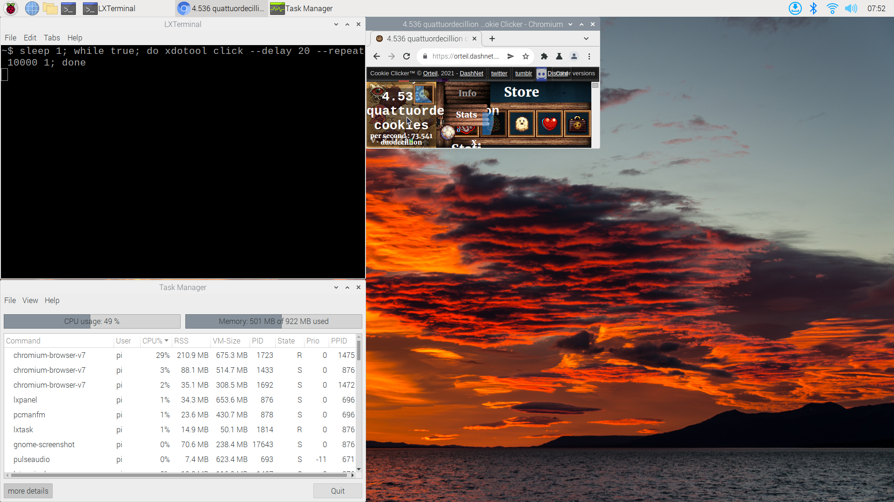
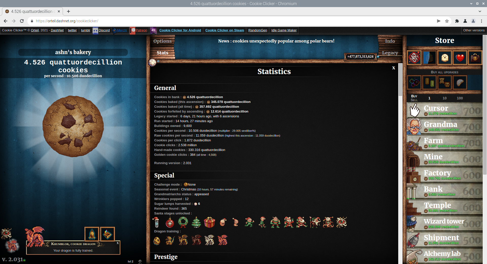

Breaking Cookie Clicker
=======================

## Setup
Last week I was itching to start some sort of low-effort mini-project and I
had the silly idea to set up a computer for the sole purpose of playing [Cookie
Clicker](https://en.wikipedia.org/wiki/Cookie_Clicker). In my miscellaneous
electronics bin I just so happened to have a Raspberry Pi 3 Starter Kit, USB
wireless adaptor[^1], USB keyboard, and USB mouse[^2].



With the addition of a spare microSD card for storage and my living room TV as
a monitor, I had all of the hardware required for a basic computer setup. I
installed Raspberry Pi OS, went through my usual Debian setup procedure, and
soon had a working machine in my living room who's entire existence would be
dedicated to running Cookie Clicker 24/7!





## Breaking Cookie Clicker
For those who are uninitiated, Cookie Clicker is an [incremental
game](https://en.wikipedia.org/wiki/Incremental_game) based around acquiring as
many cookies as possible. The game starts with the player clicking a large
on-screen cookie to acquire cookies one by one, and escalates exponentially
through the purchase of cookie-producing buildings and
cookies-per-second-multiplying upgrades to the point where the player is
acquiring hundreds of cookies-per-second, then thousands of cookies-per-second,
and so on up to unimaginable levels. There is no real goal of the game, and
player interaction is closer to bookkeeping than an interactive gameplay
experience. The enjoyment of Cookie Clicker really comes from seeing numbers
increase, and watching exponential growth spiral out of control within the
context a cookie-obsessed world filled with parallel universes, time travel,
portals to the cookieverse, and more, all geared towards the seemingly
arbitrary production of cookies.

I personally don't find these sorts of games to be very fun. Seeing numbers go
up at an ever increasing rate is enjoyable on a weirdly primal level, but
playing Cookie Clicker as intended feels more like spreadsheet management than
an actual game. However, I do find it fun to **break** Cookie Clicker by using
tools to accelerate progression and optimize cookie acquisition without
cheating[^3]. After purchasing certain upgrades, clicking on the large cookie
will produce cookies proportional to the player's cookies-per-second statistic.
Even after acquiring a good number of these upgrades, the vast majority of
cookies earned will come from sources other than clicking on the large cookie,
as the player would need to click on the large cookie many times per second
over a long period of time to match the idle cookie output of their buildings.
However, I am running Cookie Clicker on a Debian-based Linux distribution which
means it is possible automate clicking with `xdotool`!

To set up a dumb auto-clicker I open a terminal next to my Cookie Clicker
Chromium window and run the following command:
```sh
$ sleep 1; while true; do xdotool click --delay 20 -repeat 10000 1; done
```
The command starts with a one second pause to give me time to move the mouse
cursor over the large cookie in the Chromium window if I have not done so
already. The command then uses a forever-loop to repeatedly run `xdotool click
--delay 20 -repeat 10000 1` which translates to "click the left mouse button
10,000 times with 20 milliseconds in between each click". With the forever-loop,
this whole command effectively translates to "wait one second and then click
the left mouse button 50 times per second forever". When I want to stop the
auto-clicker I move the mouse cursor off of the Chromium window and back onto
the terminal window where I then press CTRL+C to interrupt the command.

By clicking at a frequency beyond the human limit I am able to far outpace the
game's idle cookies-per-second rate. For example, if clicking the large cookie
once gives me an amount of cookies equal to 5% of my cookies-per-second value,
then having an auto-clicker that can click 50 times per second means that my
effective cookies-per-second is 100% + 50 * 5% = 350% the base rate.

This increased cookie production is great, but not absolutely game breaking on
its own. The real gains in cookie production come from combining the high click
rate of an auto-clicker with stacked golden cookie effects. During gameplay a
small golden cookie will occasionally appear in a random position on screen. If
clicked the golden cookie will give you either a one-time bonus of cookies or
provide a short temporary multiplier to the player's cookie production. If the
player has purchased upgrades that increase the rate at which golden cookies
appear, as well as upgrades that increase the duration of golden cookie
multiplier effects, then it is possible to (very rarely) encounter a scenario
in which one golden cookie grants the player the "frenzy" multiplier
(multiplies cookie production by 7 for X seconds) and then while the frenzy
multiplier is still active another golden cookie grants the player the "click
frenzy" multiplier (multiplies cookies per click by 777 for Y seconds) such
that the effects stack and suddenly clicking 50 times per second will earn the
player days' worth of cookie production in mere seconds. Reducing the size of
the browser window can be used to manipulate the area in which golden cookies
spawn such that golden cookies always appear within the area of the large
cookie right under the player's cursor. Every golden cookie will get clicked
the instant it appears, and the player's cursor will already be in position to
take advantage of any frenzy + click frenzy combos that occur.



The intended way to play cookie clicker is to purchase buildings and upgrades
in order to maximize your average cookies-per-second and build up a large stash
of cookies over days or weeks. But this auto-clicker strategy transforms the
game into a puzzle all about finding ways to maximize the number of cookies
that can be acquired during these short rare random bursts of massively
increased cookie production. This strategy is incredibly effective and greatly
accelerates the rate of progression within the game. To give some perspective,
by the end of this ~7 day project I had baked a total of 357.692
quattuordecillion cookies, of which 330.316 quattuordecillion were hand made,
so 330.316 / 357.692 = ~92% of all cookies produced during the run came from
clicking on the large cookie!



## Closing Thoughts
This was an amusing mini-project. I had a fun time making arbitrary numbers
increase in a completely inconsequential setting. This is not the first time I
have done one of these tool-assisted Cookie Clicker runs, and there is a
certain tranquility that comes with working on a zero-risk project where the
outcome is already known[^4]. Like I said before, I don't really enjoy
incremental games, and this week-long run was getting to a point where the
novelty of breaking Cookie Clicker was starting to wear off. I have no
intention to continue  this run, but I will leave my save
[here](2022-03-19-breaking-cookie-clicker/ashnBakery.txt) for record keeping purposes.

🍪

## Footnotes
[^1]:
The last time I had worked with a Raspberry Pi was with the Raspberry Pi Model
2B board, which did not have an on-board WiFi adaptor. It was only after this
project concluded that I realized that the Raspberry Pi Model 3 supports
wireless without the need for a USB dongle, so my USB wireless adaptor was
completely unnecessary.

[^2]:
As well as an absolutely filthy mouse pad. 🤮

[^3]:
Where my definition of cheating specifically refers to use of the browser
JavaScript console and/or actions that would earn the player the "Cheated
cookies taste awful" shadow achievement. Use of an auto-clicker *is* considered
cheating by the [speedrun.com Cookie Clicker game
rules](https://www.speedrun.com/cclicker), but for this and other casual
experiences with the game I consider an auto-clicker fair game as long as the
auto-clicker is simulating actual click events as this setup does with
`xdotool`.

[^4]:
You make a lot of cookies and then get bored.
