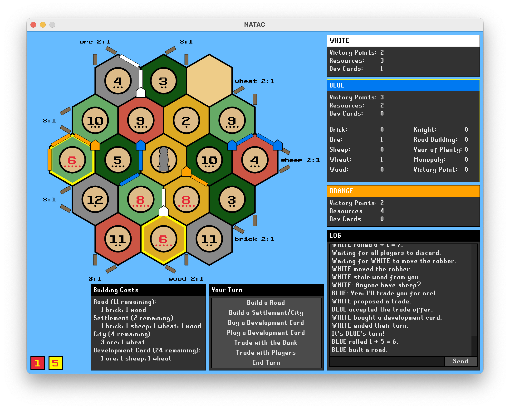
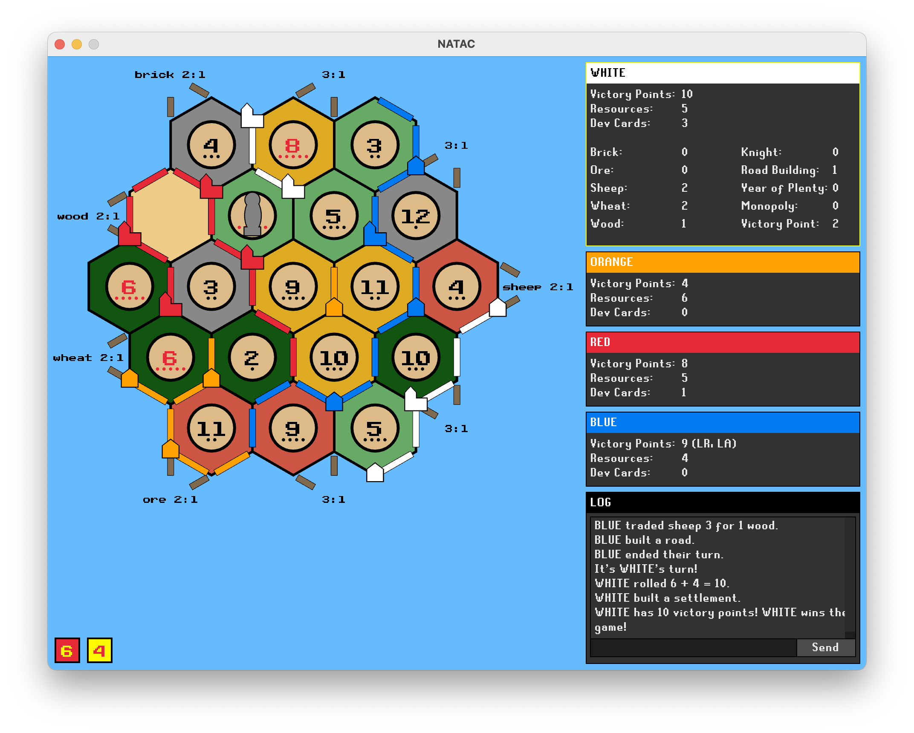

I built a Networked Catan Clone Without a Game Engine in My Own Programming Language
====================================================================================

For the past eight or so months I have been building a networked implementation
of Klaus Teuber's [Settlers of Catan](https://en.wikipedia.org/wiki/Catan) in
my own programming language, [Sunder](https://github.com/ashn-dot-dev/sunder).
After much effort, the project is finally getting to the point where it is
worth showing off! For those who want to browse the source code, my game is
called Natac, and it can be found on
[GitHub](https://github.com/ashn-dot-dev/natac) and
[SourceHut](https://git.sr.ht/~ashn/natac).

This was my first non-trival project in Sunder and is probably the largest game
I have ever worked on. I am not a game developer, and I have never seriously
studied game development or engine development, so of course this [initial alpha
release](https://github.com/ashn-dot-dev/natac/releases/tag/alpha-2024.04.13) is a mess of spaghetti code. But this project has been as much about
the journey as it has been about the destination, and I had a blast
implementing my favorite tabletop game in my own language!

For this project I used [raylib](https://github.com/raysan5/raylib) to handle
user input, graphics, and sound via my [raylib-sunder
bindings](https://github.com/ashn-dot-dev/raylib-sunder). I used
[nbnet](https://github.com/nathhB/nbnet) to handle client-server networking via
my [nbnet-sunder bindings](https://github.com/ashn-dot-dev/nbnet-sunder), which
I created specifically for this project. My network serialization and
deserialization code is handled using my own data interchange format library,
[bubby](https://github.com/ashn-dot-dev/bubby). And finally, my immediate mode
user interface code is handled by [my personal
fork](https://github.com/ashn-dot-dev/smolui) of
[microui](https://github.com/rxi/microui), also created specifically for this
project.

Currently only Linux and macOS are supported, but there are plans to bring
Natac to the browser using Sunder's WebAssembly platform support. There is
still a *ton* of work to do on the game, and no shortage of areas that could
use polish, but I am extremely happy with the project's initial alpha release.
🥳
