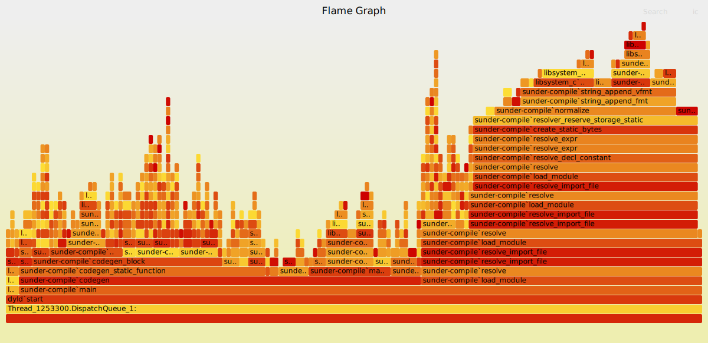

A Quick Guide to Generating Flame Graphs on macOS
=================================================

Open a terminal and build your application. In this case we will build and
profile the [Sunder](https://github.com/ashn-dot-dev/sunder) compiler,
`sunder-compile`.

```sh
~/sources/sunder$ git rev-parse HEAD
ad8af2a24f22222333b17f09e550be1e884195b4
~/sources/sunder$ make bin/sunder-compile CC=clang CFLAGS='$(GNU_REL)' >/dev/null
```

Open another terminal and clone the [FlameGraph
sources](https://github.com/brendangregg/FlameGraph) or navigate to an existing
FlameGraph source directory.

```sh
~/sources$ git clone https://github.com/brendangregg/FlameGraph.git
Cloning into 'FlameGraph'...
remote: Enumerating objects: 1285, done.
remote: Counting objects: 100% (708/708), done.
remote: Compressing objects: 100% (148/148), done.
remote: Total 1285 (delta 584), reused 574 (delta 560), pack-reused 577
Receiving objects: 100% (1285/1285), 1.92 MiB | 15.00 MiB/s, done.
Resolving deltas: 100% (761/761), done.
~/sources$ cd FlameGraph/
```

From the FlameGraph sources terminal, run `sample <APPLICATION> -wait -f
sample.output` where `<APPLICATION>` is the name of your application. The
`sample` program is installed with the Xcode command line tools by running
`xcode-select --install`.

```sh
~/sources/FlameGraph$ sample sunder-compile -wait -f sample.output
Waiting for 'sunder-compile' to appear...
```

Then, in the application terminal, run your application in a scenario you would
like to profile.

```sh
~/sources/sunder$ ./bin/sunder-compile -o hello examples/hello.sunder
```

In the FlameGraph terminal you should notice that the sample has been captured.

```sh
~/sources/FlameGraph$ sample sunder-compile -wait -f sample.output
Waiting for 'sunder-compile' to appear...  sunder-compile appeared.
Sampling process 42408 for 10 seconds with 1 millisecond of run time between samples
Sampling completed, processing symbols...
Sample analysis of process 42408 written to file sample.output
```

From the FlameGraph Terminal, run the generated `sample.output` through the
`stackcollapse-sample.awk` and `flamegraph.pl` scripts, and redirect the output
to a `.svg` file.

```sh
~/sources/FlameGraph$ cat sample.output | ./stackcollapse-sample.awk | ./flamegraph.pl > sample.svg
```

You should now have a viewable flame graph.

```sh
~/sources/FlameGraph$ firefox --new-window "file://$(realpath sample.svg)"
```

<a href="2024-05-27-macos-flame-graphs/sample.svg"></a>
